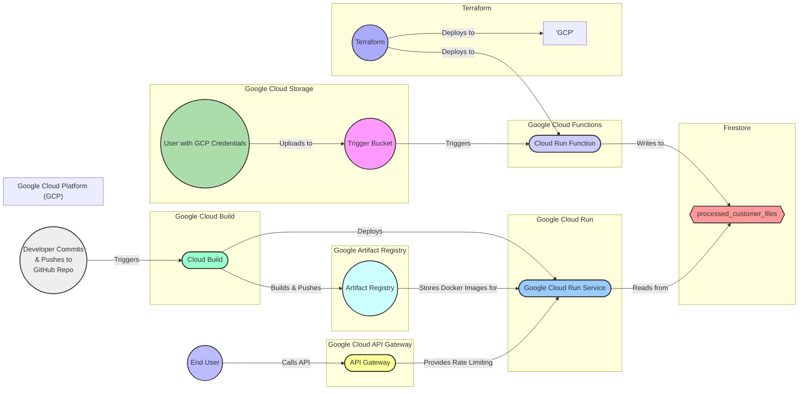

# Project Hamilius

[](https://cloud.google.com/)
[](https://www.terraform.io/)

## Overview

Project Hamilius is a serverless data processing pipeline built on Google Cloud Platform (GCP). It leverages Google Cloud Run Functions to automatically process files uploaded to a designated Google Cloud Storage bucket. Processed data is then stored and made accessible via a RESTful API served by Google Cloud Run and secured by Google Cloud API Gateway. The infrastructure is fully managed using Terraform for Infrastructure as Code (IaC).

## Architecture

The following components constitute the Project Hamilius architecture:
* **Terraform:** Terraform is used for provisioning Cloud infrastructure, and for maintaining the state of infrastructure.
* **Google Cloud Run Function:** A Python-based function triggered by object finalization events in the Trigger Bucket. It processes the content of uploaded files, currently supporting plain text files by counting lines. Other content types are identified and flagged as unsupported.
* **Google Cloud Trigger Bucket:** A Google Cloud Storage bucket serving as the entry point for content files. Upon object creation, it triggers the Cloud Run Function.
* **Firestore:** A NoSQL document database used to persist the processed data and any encountered errors. Each file uploaded to the Trigger Bucket results in a corresponding document within a specific collection.
* **Google Cloud Run (API Service):** Hosts the backend API responsible for serving processed data stored in Firestore to end-users via HTTP. This service is secured and managed by the API Gateway.
* **Google Cloud API Gateway:** Acts as a front-end for the Cloud Run API service, providing functionalities such as rate limiting and a unified access point defined by an OpenAPI (Swagger 2.0) specification.
* **Google Artifact Registry:** A private Docker image registry used to store the container image for the Google Cloud Run Function and the Cloud Run API service.
* **Google Cloud Build:** An automated CI/CD service that builds and deploys the Cloud Run API service. It is triggered by code pushes to the `development` branch of the project's GitHub repository, building container images, pushing them to Artifact Registry, and deploying the latest image to Cloud Run.

## Architecture Diagram ##


## Components

### 1. Google Cloud Run Function

* **Language:** Python
* **Trigger:** Google Cloud Storage object finalization (PUT) events on the Trigger Bucket.
* **Functionality:**
    * Reads the content of newly finalized objects via a stream.
    * For `text/plain` files, it counts the number of lines.
    * Processed line counts are saved to Firestore.
    * For unsupported content types, an error document with the message "Content type not supported" is created in Firestore.

### 2. Google Cloud Trigger Bucket

* **Purpose:** Storage for content files intended for processing.
* **Event Trigger:** Configured to send notifications to the Google Cloud Run Function upon object finalization.

### 3. Firestore

* **Database Type:** NoSQL Document Database
* **Collection:** `processed_customer_files`
* **Document Structure:** Each document represents a file processed (or attempted to be processed) from the Trigger Bucket.

  **Example Documents:**

    ```json
    {
        "content_type": "application/octet-stream",
        "created_at": "Sun, 06 Apr 2025 14:17:31 GMT",
        "error_message": "Content type not supported",
        "id": "RHiFY55Xk57rcjrJdveM",
        "object_name": "tmux-3.3a/Makefile.in",
        "status": "error"
    }
    ```

    ```json
    {
        "content_type": "text/plain",
        "created_at": "Sun, 06 Apr 2025 16:17:31 GMT",
        "id": "RHiFY55Xk57rcjrJdveM",
        "num_lines": 20,
        "object_name": "tmux-3.3a/Makefile.in",
        "status": "processed"
    }
    ```

### 4. Google Cloud Run (API Service)

* **Purpose:** Provides HTTP endpoints to query and retrieve processed data from Firestore for end users.
* **Deployment:** Hosted on Google Cloud Run for scalability and ease of management.
* **Security:** Protected by Google Cloud API Gateway.

### 5. Google Cloud API Gateway

* **Purpose:** Manages external access to the Cloud Run API service.
* **Configuration:** Defined using an OpenAPI (Swagger 2.0) specification and deployed via Terraform.
* **Features:** Includes rate limiting to control API usage.

### 6. Google Artifact Registry

* **Purpose:** Secure and private Docker image registry.
* **Contents:** Stores the container images for both the Google Cloud Run Function and the Google Cloud Run API service.

### 7. Google Cloud Build

* **Purpose:** Automates the build, test, and deployment process for the Cloud Run API service.
* **Trigger:** Initiated by code pushes to the `development` branch of the project's GitHub repository.
* **Workflow:**
    1.  Builds the Docker image for the API service.
    2.  Pushes the built image to the Google Artifact Registry.
    3.  Deploys the latest image to the Google Cloud Run service.

## APIs

The API service provides the following endpoints:

### 1. Get Processed Files

* **Endpoint:** `/processed_files`
* **HTTP Method:** `GET`
* **Description:** Retrieves a list of processed file documents from Firestore.
* **Query Parameters:**
    * `content_type`: Filters results by the original content type of the processed file (e.g., `text/plain`, `text/json`).
    * `status`: Filters results by the processing status (`processed` or `error`).
    * `limit`: Specifies the maximum number of results to return (defaults to `10`).
    * `order_by`: Determines the order of the results based on the `created_at` field (`created_at_asc` for ascending, `created_at_desc` for descending).
* **Example Request:**

    ```http
    GET /processed_files?content_type=text/plain&limit=100&status=processed HTTP/1.1
    Host: flask-api-service-gateway-gateway-60rqnpcm.ew.gateway.dev
    ```

### 2. Get Processed File by ID

* **Endpoint:** `/processed_file/<:id>`
* **HTTP Method:** `GET`
* **Description:** Retrieves a specific processed file document from Firestore based on its unique ID.
* **Path Parameter:**
    * `id`: The unique identifier of the processed file document in Firestore.
* **Example Request:**

    ```http
    GET /processed_file/RHiFY55Xk57rcjrJdveM HTTP/1.1
    Host: hamilius--flask-api-service-471862347286.europe-west1.run.app
    ```